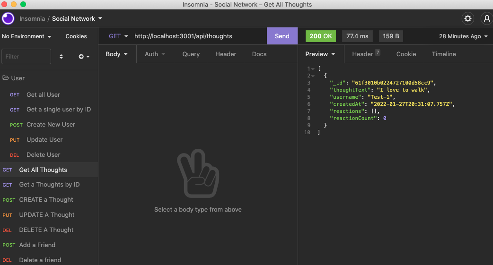

# Social-Network-API

## Description
Social Network API is the backend to an application.  This allows the user to perform the CRUD operations.  Username, email, thoughts, and friends can all be added, retrieved, and updated and deleted.  This is all done by using the Express.js for routing, MongoDB for the database, and Mongoose ODM.

## Table of Contents
- [Description](#description)
- [Installation](#installation)
- [Usage](#usage)
- [Walkthrough](#walkthrough)
- [Screenshot](#screenshot)

## Installation
npm install
npm install express
npm install mongoose.
Also make sure you have installed MongoDB on your computer

## Usage
Express.js, MongoDB, and Mongoose

## Walkthrough
https://youtu.be/gOC_iA24oi0

## Screenshot

